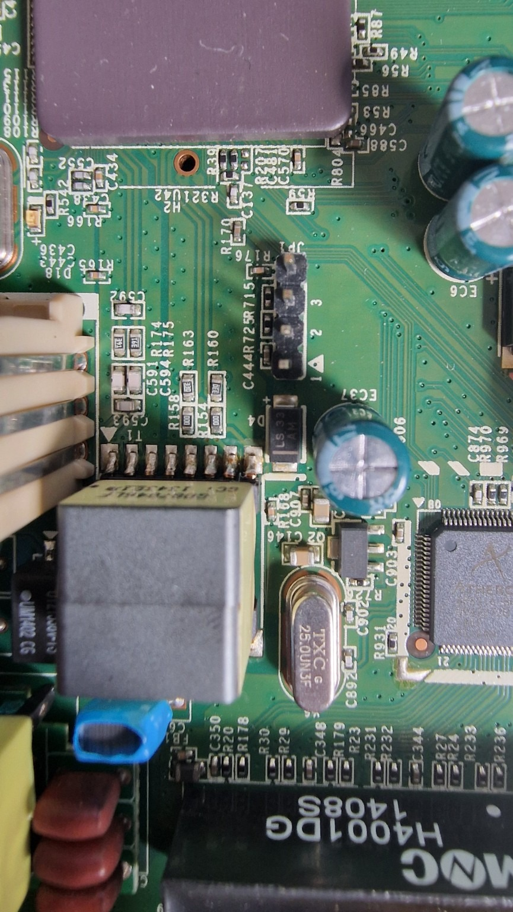
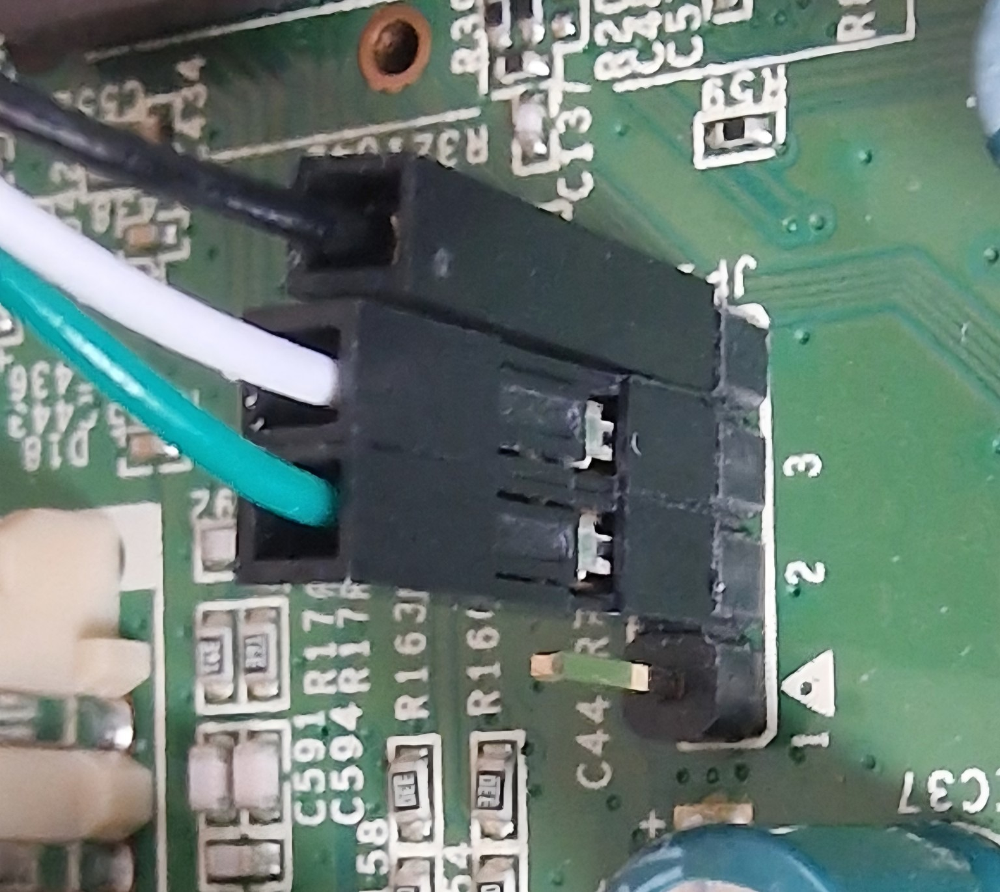
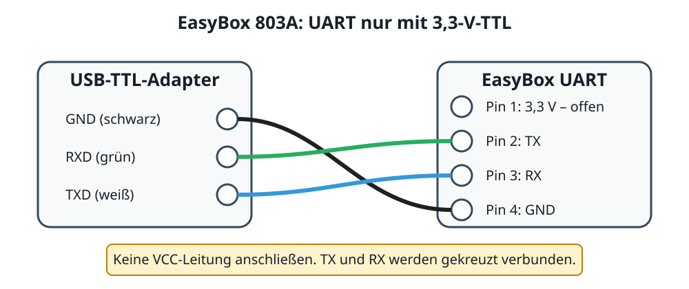

# 1. Vorbereitung und UART-Zugang

Diese Konvertierung beginnt nicht im Webinterface der Vodafone-Firmware. Sie
benötigt einen seriellen **3,3-V-TTL**-Zugang. Der Adapter versorgt den Router
nicht, sondern verbindet nur Masse sowie Sende- und Empfangsleitung.

## Benötigt

- EasyBox 803A / Arcadyan ARV752DPW22 und ihr Netzteil;
- Linux-PC mit USB- und Ethernet-Port;
- USB-zu-UART-TTL-Adapter mit **3,3 V Logikpegel**; im Referenzaufbau FTDI FT232RL;
- drei Dupont-Leitungen; keine Versorgungsspannung anschließen;
- picocom sowie sx aus dem Paket lrzsz;
- Ethernet-Kabel zwischen PC und einem LAN-Port;
- Release-Dateien und SHA256SUMS.

Ein 5-V-TTL-Adapter oder eine angeschlossene VCC-Leitung kann das Gerät
beschädigen.

## Anschluss

1. Netzteil und alle Kabel abziehen.
2. Gehäuse vorsichtig öffnen und die UART-Stiftleiste suchen.
3. Die Pin-Nummerierung am Board prüfen. Im Referenzaufbau gilt:

| EasyBox-Pin | Funktion | Adapterleitung |
|---:|---|---|
| 1 | 3,3 V | offen lassen |
| 2 | TX der EasyBox | RX des Adapters (grün im Referenzaufbau) |
| 3 | RX der EasyBox | TX des Adapters (weiß im Referenzaufbau) |
| 4 | GND | GND des Adapters (schwarz im Referenzaufbau) |

TX und RX werden gekreuzt. Eine Platinenaufnahme wird später ergänzt; das
Schema beschreibt die elektrische Verbindung vollständig. Die Farbangaben
gelten nur für den verwendeten FT232RL-Adapter: Die Beschriftung des eigenen
Adapters ist maßgeblich.

Die Fotos zeigen die **Referenzplatine**. Entscheidend sind die auf der
Leiterplatte aufgedruckten Ziffern und das Dreieck an Pin 1 – nicht die
Orientierung des Fotos oder die Kabelfarbe.

## Host vorbereiten

Im **Host-Fenster (Ubuntu)**:

~~~sh
ls -l /dev/ttyUSB*
sudo apt update
sudo apt install picocom lrzsz
sudo picocom -b 115200 --flow n /dev/ttyUSB0
~~~

Im Referenzaufbau war der Adapter /dev/ttyUSB0; bei anderem Namen ist dieser
in allen folgenden Befehlen zu ersetzen. Erwartet werden **115200 Baud, 8N1,
keine Flusskontrolle**.

Picocom wird mit Ctrl+A, danach Ctrl+X beendet. Seine interne
Dateiübertragung war unzuverlässig; die Anleitung verwendet stets sx direkt
auf dem seriellen Gerät.
